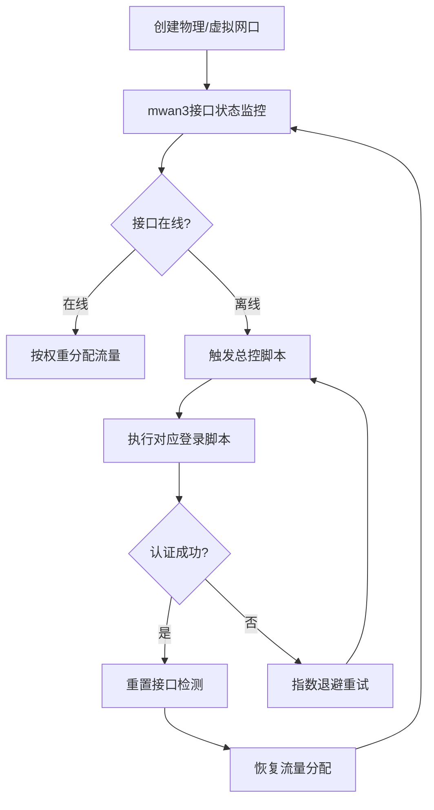

## 引言

利用mwan3自带的`可用性检测`，可以实现以下功能：

1. 多网口负载均衡，并可根据网速分配调用概率。`例：wanA:30mbps,wanB:30mbps,wanC:100mbps 则分配比例应为，3:3:10，以满足最大速率`
2. 自动软断开掉登录，不稳定的网口。
3. 对软断开的网口执行登录指令
4. 持续ping已断开的网口，检测到恢复时重新接入负载均衡。
由此，登录流程全自动，一次配置，长期免维护。理论上只要你可用于登录的账号够多，通过macvlan虚拟网口，可以一直把网速叠到链路上限（1000mbps)，且稳定运行！下面让我来分享我的方法吧。
**注意，下面的脚本均适是为了openwrt、immotalwrt等系统设计的，对于windows，请对应修改登录脚本**
**学校在3月更新了检测方法，添加了对ua字段的检测**
**脚本仅用于计算机网络学习交流，请遵守校园网络使用规定**
<!--more-->
>更新：2025/07/21
>改用了新版本的总控脚本和登陆脚本
>添加了图片，流程更好了
>引导使用Ui创建Macvlan而非使用脚本
### 设备需求

1. 支持多网口的可刷机设备（推荐软路由或支持第三方固件的路由器）
2. 1. 可安装mwan3且支持macvlan的系统环境  `兼容系统：OpenWrt、ImmortalWrt、iKuai等``
3. 一台拥有网口的电脑，用于配置路由器。
4. RJ45网线一根。

## 配置原理

本方案通过mwan3的接口状态监控能力与自定义脚本联动，实现智能流量调度和故障自愈。核心原理如下：



工作原理分解：

1. **接口虚拟化**：通过macvlan创建虚拟网口，每个虚拟口拥有独立MAC地址，可绕过校园网单设备并发限制
2. **状态监控**：mwan3持续ping测`8.8.8.8`等稳定地址，根据响应判断接口在线状态
3. **故障转移**：当检测到接口离线时：
   - 立即从负载均衡池中移除该接口
   - 触发总控脚本执行对应登录认证
4. **智能重连**：采用指数退避算法控制重试频率（4s→8s→16s...→512s）
5. **负载均衡**：基于接口带宽动态调整权重比例，计算公式：

   ```
   权重值 = 接口实测带宽 / 基准带宽（取最小带宽为基准）
   ```

6. **流量调度**：通过调整跃点数实现优先级控制，同跃点接口按权重比例分配流量

## 配置过程

### 安装mwan3

通过Web界面安装：  
进入`系统 -> 软件包`执行`更新列表`，搜索安装`luci-app-mwan3`  

或通过SSH执行：  

```bash
opkg update && opkg install luci-app-mwan3
```

### 虚拟网口创建

> 使用web页面创建虚拟网口


> 在网络-> 接口 -> 设备 ->添加设备中创建虚拟网口

选择基础设备为你的**WAN接口**对应设备（例如，我这里是eth0,创建了虚拟接口eth00,eth01,eth0x）。
设备名随意，但最好创建一个自己能记得住，分得清的名称。
不建议启用ipv6，mac地址随意/默认均可。
目前校园网支持同时登陆三个设备，所以你可以创建两个虚拟网口，以最大化单个账户。

### 登录认证脚本
>
> 登录脚本直接参与登录过程，直接执行登录脚本即可实现单次登录。后面会使用一个总控脚本来调控多个登录脚本。

```bash
#!/bin/sh

# 定义要使用的 WAN 口
MWAN3_NAME="wan"
WAN_INTERFACE="eth0"
# 输入账户和密码
WLAN_USER_ACCOUNT="在这里输入你的账户" 
WLAN_USER_PASSWORD="在这里输入你的密码"

# 获取当前的 MAC 地址和 IP 地址
WLAN_USER_MAC=$(cat /sys/class/net/$WAN_INTERFACE/address)
WLAN_USER_IP=$(ifconfig $WAN_INTERFACE | grep 'inet ' | awk '{print $2}' | sed 's/addr://')

# 日志函数
log() {
    logger -t "drcom_auth[$WAN_INTERFACE]" "$1"
    echo "$1"  # 同时输出到控制台
}

# 检查当前认证状态的函数
check_status() {
    local status_url="http://10.254.7.4/drcom/chkstatus?callback=dr1002&jsVersion=4.X&v=5505&lang=zh"
    local response=$(mwan3 use $MWAN3_NAME curl $status_url)
    
    # 提取JSON中的result字段（兼容可能存在的乱码）
    local result=$(echo "$response" | grep -o '"result":[0-9]' | cut -d':' -f2)
    
    if [ "$result" = "1" ]; then
        log "当前已认证，无需重复登录"
        return 0
    elif [ "$result" = "0" ]; then
        log "当前未认证，继续登录流程..."
        return 1
    else
        log "状态检查失败，响应: $response"
        return 2
    fi
}

# 执行登录函数
do_login() {
    # PC端登录URL
    local URL_PC="http://10.254.7.4:801/eportal/portal/login?callback=dr1004&login_method=1&user_account=%2C0%2C$WLAN_USER_ACCOUNT&user_password=$WLAN_USER_PASSWORD&wlan_user_ip=$WLAN_USER_IP&wlan_user_ipv6=&wlan_user_mac=$WLAN_USER_MAC&wlan_ac_ip=&wlan_ac_name=&ua=$PC_UA&term_type=1&jsVersion=4.2&terminal_type=1&lang=zh-cn&v=9875&lang=zh"
    
    local URL_MOBILE="http://10.254.7.4:801/eportal/portal/login?callback=dr1005&login_method=1&user_account=%2C1%2C$WLAN_USER_ACCOUNT&user_password=$WLAN_USER_PASSWORD&wlan_user_ip=$WLAN_USER_IP&wlan_user_ipv6=&wlan_user_mac=$WLAN_USER_MAC&wlan_ac_ip=&wlan_ac_name=&ua=$MOBILE_UA&term_type=2&jsVersion=4.2&terminal_type=2&lang=zh-cn&v=7090&lang=zh"
    
    log "尝试登录，使用IP: $WLAN_USER_IP, MAC: $WLAN_USER_MAC"
    local response=$(mwan3 use $MWAN3_NAME curl -s "$URL_MOBILE")
    local json_response=$(echo "$response" | grep -o '{.*}')
    
    if [ -n "$json_response" ]; then
        if echo "$json_response" | grep -q '"result":1'; then
            log "登录成功！响应: $json_response IP: $WLAN_USER_IP"
            return 0
        else
            log "登录失败！响应: $json_response"
            return 1
        fi
    else
        log "无法解析响应: $response"
        return 1
    fi
}

# 主执行流程
main() {
    
    check_status
    case $? in
        0)  # 已认证
            exit 2
            ;;
        1)  # 未认证
            if do_login; then
                exit 0
            else
                exit 1
            fi
            ;;
        *)  # 检查失败
            exit 3
            ;;
    esac
}

# 执行主函数
main

```

将以上文本保存为：**eth0_login.sh**
然后根据自身需求修改： 网口名称，校园网账号，密码。以及登录使用的**网口**
这里的两个不同的接口是怎么回事呢？见图


一个是wrt软件接口名称，一个是硬件名称，有区分的必要。使用接口名称来调用mwan3的 `mwan3 use`命令，更精确。
使用网口名称来获取 `ip 和 mac` 地址

```bash
# 定义要使用的 WAN 口
MWAN3_NAME="wan" #适用于mwan3的接口名，即在网络->接口 中可见的接口名称，是openwrt软件上抽象的接口
WAN_INTERFACE="wan" # 硬件的网卡名称
```

由于校园网支持同时登录一个安卓设备和两个电脑设备，所以你可以**登录自己的账号三次**，网速x3
如果想要占用pc设备位，修改上述登录脚本的这个部分：

```bash
do_login()
...
    log "尝试登录，使用IP: $WLAN_USER_IP, MAC: $WLAN_USER_MAC"
    local response=$(mwan3 use $MWAN3_NAME curl -s "$URL_MOBILE")<- 修改这一行的"$URL_MOBILE" 为"$URL_PC"
...

```

> 例如，根据上面创建的MACVLAN网口(假设你和我一样命名为eth01和eth02)，那么你将拥有：
> 一个物理网口，两个虚拟网口。三个登录脚本：`eth0_login.sh`,`eth01_login.sh`,`eth02_login.sh`
> 其中，任意两个使用pc_url,另外一个使用mobile_url

### 上传脚本

1. 将`*_login.sh`上传至路由器`推荐路径：/root/`
2. 使用MobaXterm等工具赋予可执行权限：  

   ```bash
   chmod +x /root/*.sh
   ```

#### 测试登录脚本

在shell中执行：
登录脚本

```sh
sh /root/eth0_login.sh
```

预期输出：
`wan 登录成功！`
`获取到的IP地址xx.xxx.xx.xx`
或者
`当前已认证，无需重复登录`
如果输出与预期不符，请结合ai，文档检查错误。

### 总控脚本
>
> 该部分脚本利用mwan3接口获取接口可用性，对状态为非“online”的接口，执行其登录脚本。

```bash
#!/bin/bash

# 配置区：只需修改此处即可增删接口
INTERFACE_CONFIG="
wan  /root/login_shell/eth00_login.sh
"

# 全局参数
INITIAL_RETRY_DELAY=4
MAX_RETRY_DELAY=4096
ALREADY_LOGGED_DELAY=16  # 已登录但掉线时的固定延迟

# 日志函数增强
log() {
  local level=$1
  local message=$2
  

  case "$level" in
    "debug")
      # debug 级别不记录
      return
      ;;
    "info"|"notice"|"warning"|"error")
      logger -t "drcom_auth[$$]" -p "user.$level" "[$level] $message"
      ;;
    *)
      # 未知级别按 info 处理
      logger -t "drcom_auth[$$]" -p "user.info" "[unknown] $message"
      ;;
  esac
}

# 登录函数
login_interface() {
  local interface_name=$1
  local login_script=$2
  local delay_var=$3

  eval "current_delay=\${$delay_var}"

  [ -f "$login_script" ] || {
    log "error" "$interface_name 错误：登录脚本 '$login_script' 未找到"
    return 3  # 脚本不存在
  }

  # 执行登录脚本并捕获返回码
  sh "$login_script" >/tmp/login_output_$interface_name 2>&1
  local login_result=$?
  local login_output=$(cat /tmp/login_output_$interface_name)
  rm -f /tmp/login_output_$interface_name

  case $login_result in
    0)  # 登录成功
      new_delay=$INITIAL_RETRY_DELAY
      eval "$delay_var=$new_delay"
      log "notice" "$interface_name 登录成功 - 重置延迟为 $new_delay 秒"
      log "debug" "登录输出: $login_output"
      return 0
      ;;
    1)  # 登录失败
      new_delay=$(( current_delay * 2 ))
      [ $new_delay -gt $MAX_RETRY_DELAY ] && new_delay=$MAX_RETRY_DELAY
      eval "$delay_var=$new_delay"
      log "warning" "$interface_name 登录失败 - 下次延迟为 $new_delay 秒"
      log "debug" "失败输出: $login_output"
      return 1
      ;;
    2)  # 已登录状态
      eval "$delay_var=$ALREADY_LOGGED_DELAY"
      log "info" "$interface_name 已登录状态 - 设置固定延迟 $ALREADY_LOGGED_DELAY 秒"
      return 2
      ;;
    *)  # 其他错误
      log "error" "$interface_name 未知返回码 $login_result"
      log "debug" "完整输出: $login_output"
      return 3
      ;;
  esac
}

# 主程序
main() {
  local interfaces=()
  local scripts=()
  local delays=()

  # 配置解析
  while IFS= read -r line; do
    line=$(echo "$line" | awk '{$1=$1; print}')
    [ -z "$line" ] && continue
    interface=$(echo "$line" | awk '{print $1}')
    path=$(echo "$line" | awk '{print $2}')
    interfaces+=("$interface")
    scripts+=("$path")
    # 初始化延迟变量
    eval "delay_$interface=$INITIAL_RETRY_DELAY"
    delays+=("delay_$interface")
  done <<EOF
$INTERFACE_CONFIG
EOF

  log "info" "启动多WAN口自动登录守护进程 (PID: $$)"
  log "debug" "加载接口配置: ${interfaces[@]}"

  # 主循环
  while true; do
    local max_delay=1
    local interface_status=$(mwan3 interfaces 2>/dev/null)
    local need_action=false

    for ((i=0; i<${#interfaces[@]}; i++)); do
      local iface="${interfaces[i]}"
      local script="${scripts[i]}"
      local delay_var="${delays[i]}"

      # 检查接口状态
      if echo "$interface_status" | grep -qw "interface $iface is offline"; then
        need_action=true
        log "debug" "$iface 检测到离线状态"
        login_interface "$iface" "$script" "$delay_var"
        retval=$?
        
        eval "current_delay=\${$delay_var}"
        [ $current_delay -gt $max_delay ] && max_delay=$current_delay
        
        # 根据返回码记录不同日志
        case $retval in
          0) log "info" "$iface 处理完成: 登录成功" ;;
          1) log "warning" "$iface 处理完成: 登录失败" ;;
          2) log "info" "$iface处理完成: 已登录但掉线" ;;
          3) log "error" "$iface 处理完成: 脚本错误" ;;
        esac
      else
        eval "$delay_var=$INITIAL_RETRY_DELAY"
        log "debug" "$iface 在线状态正常"
      fi
    done
    # 动态休眠控制
    if $need_action; then
      log "debug" "本轮检测完成，最大延迟 $max_delay 秒"
      sleep $max_delay
    else
      log "debug" "所有接口正常，短暂休眠 5 秒"
      sleep 5
    fi
  done
}
# 信号捕获
trap 'log "notice" "收到终止信号，退出程序"; exit 0' INT TERM
main
```

---

### 图形化配置

#### 创建接口

1. 进入`网络 -> 接口 -> 添加新接口`
2. 命名规则：wanA、wanB...
3. 协议选择`DHCP客户端`
4. 设备 选择你创建的虚拟设备eth01等
点击创建接口。


#### 接口参数

1. 高级设置中设置唯一`网关跃点`
2. 防火墙区域指定为`wan`
3. 确保勾选`忽略此接口`（DHCP服务）


### mwan3配置

1. 进入`网络 -> 负载均衡 -> 接口`
2. 删除默认接口，新建对应虚拟接口
3. 每个接口配置：
   - 启用状态：√
   - 追踪地址：223.5.5.5,223.6.6.6，114.114.114
   - 跟踪可靠性：建议2
   - 检测间隔：建议5秒
   - 检测超时：建议2秒
其余设置看图：


#### 编辑接口成员（用于分配负载）

1. 解释：跃点数代表接口优先级，权重则代表该接口在同跃点数中占的比重。
2. 成员配置示例：
   - wan_m1_w3（跃点1，权重3）
   - wanA_m1_w2（跃点1，权重2）

> 注意，若使用不同的跃点数，wan_m1_w2,wanA_m2_w3，那么wan将  **占用100%的流量**，**wanA 占比为0%**
> 完成修改后，请点击保持并应用。保存自己的更改。

请根据需求添加成员
例如：两个同速率的接口，请使用 相同的跃点和相同的权重。wan_m1_w2,wanA_m1_w2。

#### 修改策略

1. 选择 **策略** 页面
2. 修改策略 balanced 删除原先自带的策略。把自己上面添加的成员写上去。

> 例：wan_m1_w2,wanA_m1_w2
>

#### 确认规则

确认`default_rule_v4`使用新建的均衡策略

---

### 运行

1. 这里推荐使用图形化的shell脚本管理器nettask来运行管理脚本。[nettask下载](https://github.com/lucikap/luci-app-nettask)

> 下载完成luci-app-nettask.ipk后，上传到任意位置，使用opkg install安装即可
> 例如 opkg install /root/luci-app-nettask.ipk

2. 安装完成后刷新luci网页。在`系统->自定义脚本` 下的 `立即执行` 中粘贴上方的 自己修改好的 **总控脚本**

> 如果不清楚应该怎么修改，请结合gpt等ai工具，它会帮助你。

3. 点击保存后，立即执行。
在状态->系统日志 中应当能看到对于的登录日志。

## 成功

**在这步之后，应当就能正常负载均衡上网了！**

### 状态验证

1. 在`状态 -> 负载均衡`中确认各接口在线状态
2. 典型正常状态显示：  


```
接口 wan 状态 在线 运行时间 12h:34m:56s
 ```

如果不是这样，请点击详细信息，检查interface status。

如果接口状态全部为error，请检查网关跃点和mwan3配置。

如果重启路由器后，接口状态为error，请尝试随便修改一点mwan3的什么。（例如修改规则的顺序）然后点击保存并应用，自动重启mwan3 后，状态恢复正常。

> 我也不知道为什么会有这种情况，能用就行（

## 结语

本方案通过智能流量调度和自动故障恢复机制，可有效提升网络可靠性和吞吐量。实际测试中，在配置3个虚拟接口的情况下，（两个30Mbps,一个100Mbps）实现了长期稳定的200Mbps寝室网络接入。并可分享给全寝室人用。
